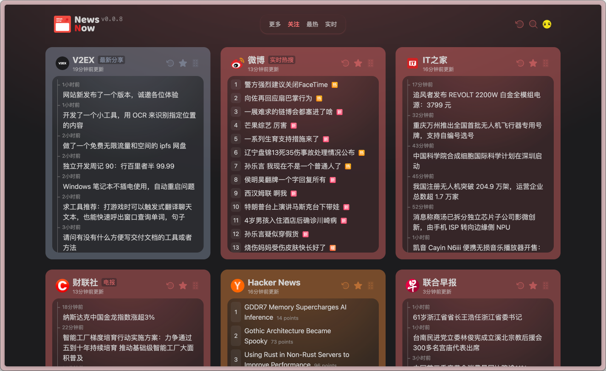
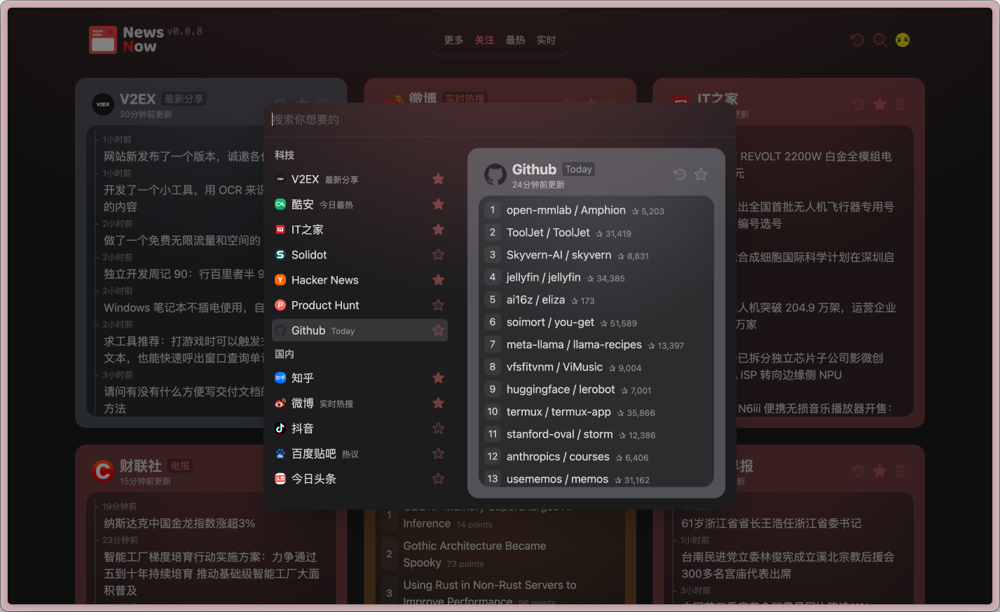

# NewsNow




[English](./README.md) | [简体中文](README.zh-CN.md) | 日本語

> [!NOTE]
> 本バージョンはデモ版であり、現在中国語のみ対応しています。カスタマイズ機能や英語コンテンツをサポートした正式版は後日リリース予定です。

***リアルタイムで最新のニュースをエレガントに読む***

## 機能
- 最適な読書体験のためのクリーンでエレガントなUIデザイン
- トレンドニュースのリアルタイム更新
- GitHub OAuthログインとデータ同期
- デフォルトのキャッシュ期間は30分（ログインユーザーは強制更新可能）
- リソース使用を最適化し、IPブロックを防ぐためのソース更新頻度に基づく適応型スクレイピング間隔（最短2分）

## デプロイ

### 基本デプロイ
ログインとキャッシュ機能なしでデプロイする場合：
1. このリポジトリをフォーク
2. Cloudflare PagesやVercelなどのプラットフォームにインポート

### Cloudflare Pages設定
- ビルドコマンド：`pnpm run build`
- 出力ディレクトリ：`dist/output/public`

### GitHub OAuth設定
1. [GitHub Appを作成](https://github.com/settings/applications/new)
2. 特別な権限は不要
3. コールバックURLを設定：`https://your-domain.com/api/oauth/github`（your-domainを実際のドメインに置き換え）
4. Client IDとClient Secretを取得

### 環境変数
`example.env.server`を参照。ローカル開発では、`.env.server`にリネームして以下を設定：

```env
# GitHub Client ID
G_CLIENT_ID=
# GitHub Client Secret
G_CLIENT_SECRET=
# JWT Secret（通常はClient Secretと同じ）
JWT_SECRET=
# データベース初期化（初回実行時はtrueに設定）
INIT_TABLE=true
# キャッシュを有効にするかどうか
ENABLE_CACHE=true
```

### データベースサポート
対応データベースコネクタ： https://db0.unjs.io/connectors Cloudflare D1 Database を推奨。

1. Cloudflare WorkerダッシュボードでD1データベースを作成
2. `wrangler.toml` に `database_id` と `database_name` を設定
3. `wrangler.toml` が存在しない場合、 `example.wrangler.toml` をリネームして設定を変更
4. 次回デプロイ時に変更が反映

### Dockerデプロイ
プロジェクトルートディレクトリで：

```sh
docker compose up
 ```

環境変数は `docker-compose.yml` でも設定可能。

## 開発
> [!TIP]
> Node.js >= 20が必要

```sh
corepack enable
pnpm i
pnpm dev
 ```

### データソースの追加
`shared/sources` と `server/sources` ディレクトリを参照。プロジェクトは完全な型定義とクリーンなアーキテクチャを提供します。

## ロードマップ
- **多言語サポート**の追加（英語、中国語、その他言語を順次対応）
- **パーソナライズオプション**の改善（カテゴリ別ニュース、保存された設定）
- **データソース**の拡充による多言語対応のグローバルニュースカバレッジ

## コントリビューション
コントリビューションを歓迎します！機能リクエストやバグレポートのために、プルリクエストやイシューの作成をお気軽にどうぞ。

## ライセンス
MIT © ourongxing
